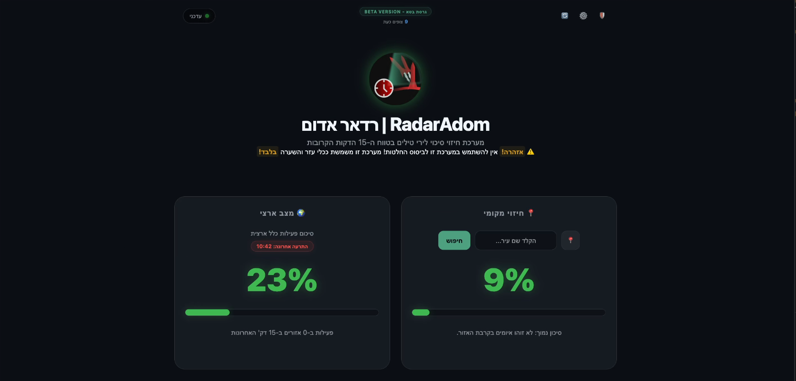

  

<h1 align="center">AlertRadar</h1>

Real-time missile risk analysis & alert prediction for Israel

  
  
  

AlertRadar is an analytical system that monitors and predicts missile alerts in Israel. It aggregates data from official sources, news feeds, and user-submitted reports to calculate risk levels for different cities and regions.

## Screenshots

  
  

## Demo Video

---

## Features

- Real-time risk scoring for local and national regions  
- Integration with **Pikud Haoref** (Home Front Command) and **Tzofar** alert APIs  
- Pre-warning and active alert differentiation  
- News scanning (Ynet, Mako, Maariv, Walla, Hamal) for early detection  
- Telegram bot integration for manual reports and confirmations  
- Prediction map for neighboring cities (“bleed-over” risk)  
- Historical alert logging with decay and trend analysis  

---

## Acknowledgments / Data Sources

- Pikud Haoref (Oref) – official alert API
- Tzofar – backup historical alert data
- Israeli news outlets: Ynet, Mako, Maariv, Walla, Hamal
- Community contributions & feedback
